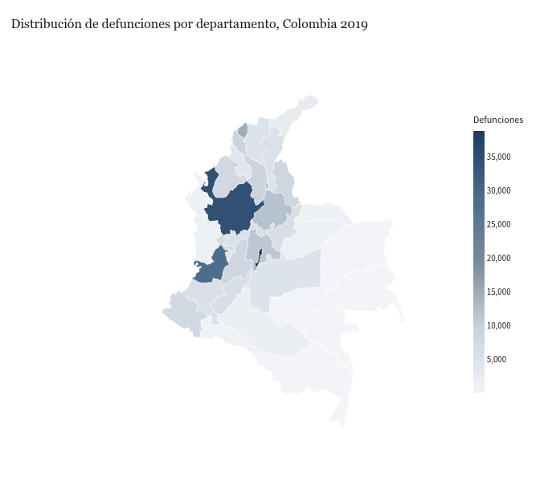
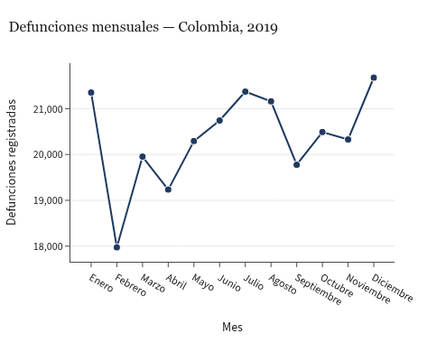
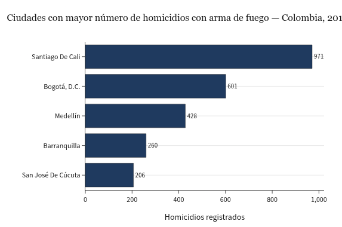
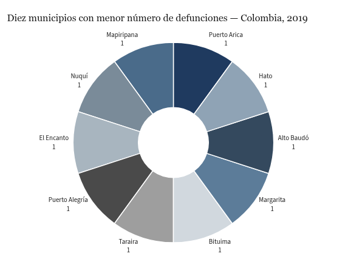
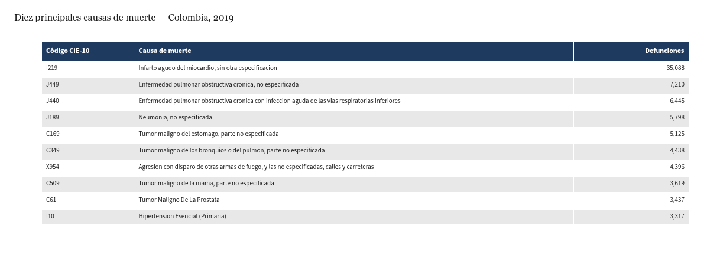
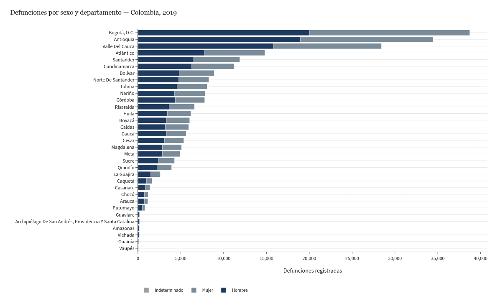
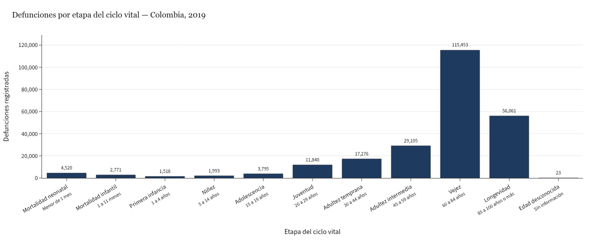

# Mortalidad en Colombia 2019 — Aplicación web interactiva

Aplicación web dinámica construida con Python, Dash y Plotly para el análisis interactivo de la mortalidad no fetal registrada en Colombia durante el año 2019, a partir de los microdatos publicados por el DANE.

## Introducción

El registro de defunciones es uno de los insumos primarios de la política pública en salud y de los análisis demográficos. El DANE recopila esta información de manera continua a través de los certificados de defunción y la publica como microdatos anonimizados en su catálogo de Estadísticas Vitales (EEVV). Este proyecto toma el conjunto correspondiente al año 2019 —con 244.355 defunciones no fetales registradas— y lo presenta como un tablero interactivo que combina mapa, series temporales, comparaciones por sexo y por etapas del ciclo vital, y la nomenclatura oficial CIE-10 de causas de muerte.

La aplicación está pensada como una herramienta de exploración para estudiantes, docentes y analistas que deseen identificar concentraciones geográficas, variaciones mensuales y patrones demográficos sin necesidad de manipular los microdatos directamente.

## Objetivo

Construir una aplicación web dinámica, accesible en línea, que permita explorar la mortalidad en Colombia en 2019 desde siete enfoques complementarios: distribución geográfica, evolución mensual, violencia urbana medida por homicidios con arma de fuego (CIE-10 X95), municipios con menor incidencia, principales causas de muerte, comparación por sexo entre departamentos y distribución por etapa del ciclo vital.

## Estructura del proyecto

```
mortalidad-colombia-2019/
├── app.py                          Punto de entrada de la aplicación Dash
├── pyproject.toml                  Definición del proyecto y dependencias (uv)
├── requirements.txt                Dependencias pinneadas para Render
├── Procfile                        Comando de arranque (gunicorn)
├── runtime.txt                     Versión de Python para Render
├── data/
│   ├── raw/                        Microdatos originales del DANE (.xlsx)
│   └── processed/                  Dataset enriquecido (.parquet) y resumen
├── src/
│   ├── data/                       Carga, normalización y enriquecimiento
│   ├── viz/                        Funciones generadoras de figuras Plotly
│   └── layout/                     Componentes del layout Dash
├── scripts/
│   ├── build_processed.py          Genera el dataset enriquecido a partir de raw/
│   └── inventory.py                Inventario inicial de las columnas
├── assets/                         CSS y GeoJSON consumidos por la app
└── docs/                           Capturas que ilustran los resultados
```

## Requisitos

| Componente | Versión |
|---|---|
| Python | 3.11 |
| Dash | 4.1.0 |
| Plotly | 6.7.0 |
| Pandas | 3.0.3 |
| openpyxl | 3.1.5 |
| pyarrow | 24.0.0 |
| gunicorn | 26.0.0 |

Las versiones exactas resueltas para producción están en `requirements.txt`.

## Despliegue en Render

La aplicación se publica como **Web Service** en Render bajo el plan **Free**. Los archivos necesarios para el despliegue (`Procfile`, `runtime.txt`, `requirements.txt`) están versionados en la raíz del repositorio.

### Prerrequisitos

- Cuenta activa en [Render](https://render.com) iniciada con la misma cuenta de GitHub donde está alojado el repositorio.
- Repositorio `mortalidad-colombia-2019` accesible desde Render (autorizado al iniciar sesión con GitHub).

### Pasos seguidos para el despliegue

1. Iniciar sesión en el [dashboard de Render](https://dashboard.render.com).
2. Hacer clic en **New +** (esquina superior derecha) y seleccionar **Web Service**.
3. Elegir la opción **Build and deploy from a Git repository** y continuar.
4. Seleccionar el repositorio `mortalidad-colombia-2019`. Si no aparece en la lista, abrir **Configure account** y conceder acceso a Render desde GitHub.
5. Completar el formulario de creación con los siguientes parámetros:

   | Parámetro | Valor |
   | --- | --- |
   | Name | `mortalidad-colombia-2019` |
   | Region | `Oregon (US West)` |
   | Branch | `main` |
   | Root Directory | *(dejar vacío)* |
   | Runtime | `Python 3` |
   | Build Command | `pip install -r requirements.txt` |
   | Start Command | `gunicorn app:server --workers 1 --threads 4 --timeout 120 --bind 0.0.0.0:$PORT` |
   | Instance Type | `Free` |

6. En la sección **Advanced**, mantener **Auto-Deploy** activado sobre la rama `main` para que cada `git push` genere un nuevo despliegue. No se requieren variables de entorno adicionales.
7. Hacer clic en **Create Web Service**. El primer build toma entre cinco y diez minutos.
8. Una vez finalizado, Render expone la aplicación en una URL pública. La URL asignada en este despliegue es: <https://mortalidad-colombia-2019-bmkh.onrender.com/>.

### Validación posterior al despliegue

- Acceder a la URL pública en una ventana de navegador limpia y verificar que las siete visualizaciones se carguen.
- Cambiar el valor del filtro de departamento y comprobar que las cinco gráficas reactivas se actualicen.

> **Nota sobre el plan Free.** Render suspende la instancia tras quince minutos de inactividad. El primer acceso después de un periodo prolongado puede tardar entre treinta y sesenta segundos en responder mientras el servicio se reactiva.

## Software utilizado

- **Python 3.11** como lenguaje base.
- **Dash y Plotly** para la capa de visualización e interacción.
- **Pandas** para el procesamiento de los microdatos.
- **uv** como gestor de entorno y dependencias en desarrollo.
- **gunicorn** como servidor WSGI en producción.
- **Render** como plataforma como servicio (PaaS) para el despliegue.

## Instalación local

Clonar el repositorio y crear el entorno de desarrollo:

```bash
git clone https://github.com/ProfeJulianLasso/mortalidad-colombia-2019.git
cd mortalidad-colombia-2019
uv sync
```

Generar el dataset procesado a partir de los archivos del DANE (este paso solo se requiere si se modifican los datos crudos):

```bash
uv run python scripts/build_processed.py
```

Ejecutar la aplicación localmente:

```bash
uv run python app.py
```

La aplicación queda disponible en `http://127.0.0.1:8050/`.

## Visualizaciones e interpretación de hallazgos

Las cifras presentadas corresponden al universo de **244.355 defunciones no fetales registradas en Colombia durante 2019**. El usuario puede filtrar cinco de las siete visualizaciones por departamento desde el control superior de la aplicación; el mapa nacional y la comparación por sexo se mantienen siempre con cobertura nacional para preservar la comparabilidad.

### 1. Distribución geográfica de la mortalidad por departamento



El mapa muestra una concentración marcada en el centro y occidente del país. Los tres departamentos con mayor número de defunciones —Bogotá D.C. (38.760, 15,86 %), Antioquia (34.473, 14,11 %) y Valle del Cauca (28.443, 11,64 %)— concentran en conjunto el **41,61 %** del total nacional, y los cinco primeros (sumando Atlántico y Santander) acumulan el **52,54 %**. En el otro extremo, los departamentos amazónicos y de la Orinoquía —Vichada (188), Guainía (115) y Vaupés (87)— exhiben menos del 0,1 % cada uno, lo que es consistente con su baja densidad poblacional.

### 2. Variación mensual de las defunciones



La serie mensual presenta una variación pico-valle del **20,6 %**: el mes con mayor número de defunciones es **diciembre (21.678)** y el mes con menor registro es **febrero (17.974)**. El promedio mensual nacional se sitúa en 20.363 defunciones. El comportamiento estacional, con valles en febrero-abril y picos en diciembre-enero, es coherente con la curva esperable para una población con clima tropical en la que las temporadas de transmisión respiratoria y las festividades de fin de año tienden a elevar la mortalidad por causas circulatorias y respiratorias.

### 3. Ciudades con mayor incidencia de homicidios con arma de fuego (CIE-10 X95)



Los códigos CIE-10 que comienzan con **X95** —agresión con disparo de otras armas de fuego y casos no especificados— concentran **9.273 defunciones**, equivalentes al **3,79 %** del total nacional. Cinco municipios reúnen el **26,59 %** de esos casos: Santiago de Cali lidera con **971 homicidios (10,47 % del total X95 nacional)**, seguida por Bogotá D.C. (601, 6,48 %), Medellín (428, 4,62 %), Barranquilla (260, 2,80 %) y Cúcuta (206, 2,22 %). La sobre-representación de Cali es coherente con la literatura sobre violencia armada en el Valle del Cauca y supera la concentración esperada por tamaño poblacional.

### 4. Municipios con menor número de defunciones registradas



Los diez municipios con menor número de defunciones registradas presentan **una sola defunción cada uno** y corresponden mayoritariamente a corregimientos y áreas no municipalizadas del Amazonas, Guainía, Chocó, Vaupés, Bolívar, Santander y Cundinamarca. Esta lista no debe interpretarse como evidencia de mejor salud relativa: refleja, fundamentalmente, una combinación de baja densidad poblacional, subregistro y, en algunos casos, problemas de acceso al certificado de defunción. La aplicación excluye los municipios sin defunciones registradas para evitar lecturas espurias.

### 5. Diez principales causas de muerte



Las diez causas más frecuentes concentran el **32,28 % de las defunciones nacionales**. La causa singular más importante es el **infarto agudo del miocardio (CIE-10 I21.9), con 35.088 casos** (14,36 % del total) —más del doble de cualquier otra causa específica—. A continuación aparecen la enfermedad pulmonar obstructiva crónica (J44.9 y J44.0, sumando 13.655 casos), la neumonía no especificada (J18.9, 5.798), tumores malignos (estómago, bronquios o pulmón, mama y próstata) y la única causa violenta en la lista, **agresión por arma de fuego en calles y carreteras (X95.4) con 4.396 casos** (1,80 %). El patrón es típico de una transición epidemiológica en curso, dominado por enfermedades cardiovasculares y neoplásicas pero todavía con peso visible de la violencia y de causas infecciosas.

### 6. Distribución de defunciones por sexo en cada departamento



A nivel nacional fallecieron **134.573 hombres y 109.689 mujeres**, con una **razón de 1,23 defunciones masculinas por cada femenina**. La brecha varía marcadamente entre territorios: **Guaviare presenta la razón más alta, con 3,36 hombres por cada mujer fallecida**, lo que es consistente con su perfil de violencia rural y baja proporción de población femenina adulta. En el extremo opuesto, **Bogotá D.C. tiene la razón más cercana a la paridad (1,07 hombres por cada mujer)**, lo que refleja una mortalidad más cardiovascular y menos violenta. La visualización ordena los departamentos de menor a mayor mortalidad total para facilitar la lectura comparada.

### 7. Distribución por etapa del ciclo vital



La mortalidad colombiana en 2019 se concentra de manera abrumadora en las edades avanzadas: **Vejez (60–84 años) acumula el 47,25 % y Longevidad (85 años o más) el 22,94 %, sumando entre ambas el 70,19 % del total**. La mortalidad infantil temprana, agregando neonatal, infantil y primera infancia, asciende a 8.809 defunciones (3,60 %), una cifra alineada con la tendencia descendente histórica de Colombia. La categoría Edad desconocida es marginal (23 casos, 0,01 %), lo que evidencia una buena calidad del sistema de captura en este campo. La visualización conserva el orden cronológico del ciclo vital y no el orden de frecuencia, lo que permite leer el patrón demográfico de un vistazo.

## Conclusiones

La lectura conjunta de las siete visualizaciones permite articular los siguientes hallazgos transversales sobre la mortalidad no fetal en Colombia durante 2019:

- **Concentración geográfica marcada.** Solo tres departamentos (Bogotá D.C., Antioquia y Valle del Cauca) explican el **41,61 %** del total nacional, y los cinco primeros acumulan más de la mitad de las defunciones registradas. Esta concentración es coherente con la distribución poblacional del país, pero también pone en evidencia la magnitud de los retos en salud pública para los grandes núcleos urbanos.
- **Patrón epidemiológico característico de una transición.** Las causas más frecuentes son crónicas y degenerativas: el **infarto agudo del miocardio (I21.9) por sí solo explica el 14,36 %** de la mortalidad nacional, y junto con la enfermedad pulmonar obstructiva crónica, las neumonías y los tumores malignos (estómago, pulmón, mama y próstata) suman cerca del 30 % del total. Este perfil es típico de poblaciones que han envejecido y reducido la mortalidad infantil pero que todavía no controlan los factores de riesgo cardiovascular y oncológico.
- **Estructura demográfica envejecida en la mortalidad.** El **70,19 %** de las defunciones ocurre en personas de 60 años o más (Vejez y Longevidad), mientras que la mortalidad infantil temprana representa apenas el 3,60 %. El sistema de registro capta con precisión la edad: solo 23 casos (0,01 %) quedan con edad desconocida.
- **Violencia urbana focalizada y desproporcionada.** Los homicidios con arma de fuego (CIE-10 X95) son el **3,79 %** del total nacional, pero su concentración geográfica es extrema: **Santiago de Cali registra el 10,47 % de los casos X95 del país** y los cinco municipios con mayor incidencia (Cali, Bogotá D.C., Medellín, Barranquilla y Cúcuta) acumulan el 26,59 %. La violencia armada es un fenómeno predominantemente urbano y supera lo esperable por la sola distribución poblacional.
- **Brecha estructural por sexo con variación territorial.** A nivel nacional, fallecen **1,23 hombres por cada mujer**, pero la razón se eleva a **3,36 en Guaviare** —reflejo de su perfil de violencia rural y migración masculina— y baja a **1,07 en Bogotá D.C.**, donde la mortalidad es más cardiovascular y menos violenta. La comparación apilada permite identificar de un vistazo los territorios con mayor sobre-mortalidad masculina.
- **Estacionalidad moderada con picos previsibles.** La diferencia entre el mes con más y menos defunciones (diciembre frente a febrero) es del **20,6 %**, un patrón compatible con la concentración invernal de causas cardiovasculares y respiratorias y con el incremento de muertes violentas y por accidentes que históricamente se observa al cierre del año en Colombia.

En su conjunto, los datos confirman que el reto sanitario y social del país combina dos agendas simultáneas: por un lado, las enfermedades crónicas asociadas al envejecimiento poblacional, y por otro, la persistencia de la violencia urbana focalizada como causa significativa de mortalidad evitable.

## Notas metodológicas

- Los códigos administrativos (departamento y municipio) se preservan como cadenas con ceros a la izquierda para evitar joins fallidos contra el catálogo DIVIPOLA y la geometría departamental.
- La descripción de la causa de muerte se resuelve preferentemente con el código CIE-10 de cuatro caracteres y, si no se encuentra, con el de tres caracteres como respaldo.
- La categoría "menor mortalidad" excluye los municipios sin defunciones registradas porque en ese conjunto se mezclan corregimientos sin certificación local con verdaderos casos de ausencia de muertes. El criterio se hace explícito tanto en la aplicación como en este informe.
- El filtro por homicidios usa el prefijo CIE-10 X95, que cubre los códigos X95.0 a X95.9 (agresión con disparo de armas de fuego, incluyendo los casos no especificados).
- La razón hombre-mujer se calcula con base en los casos con sexo identificado; los 93 registros con sexo indeterminado se incluyen en los totales pero no en el cociente.

## Fuente de los datos

Departamento Administrativo Nacional de Estadística (DANE). *Estadísticas Vitales (EEVV) 2019 — Defunciones no fetales*. Catálogo de microdatos 696. Bogotá D.C., Colombia. Recuperado de https://microdatos.dane.gov.co/index.php/catalog/696.

La geometría de los departamentos se tomó del repositorio público mantenido por john-guerra en GitHub, derivado a su vez de los polígonos administrativos del Instituto Geográfico Agustín Codazzi (IGAC).

## Autor

**Julián Andrés Lasso Figueroa**
Maestría en Inteligencia Artificial — Universidad de La Salle
Curso: Aplicaciones de Inteligencia Artificial
